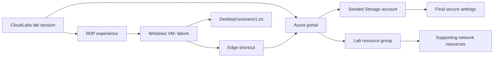

# Getting Started: Broken Azure Environment

### Estimated Duration: 10 Minutes

## Scenario

You are investigating a deliberately misconfigured Azure environment. A seeded Azure Storage account does not yet meet the lab security baseline, and a Windows lab VM requires a completion file. You will use the Azure portal to inspect and remediate the storage configuration, use the Windows desktop on `labvm` to create the required file, and then complete five inline knowledge checks. The assessment validates the resulting resource and file states rather than a particular sequence of clicks.

## Lab overview

This is a 90-minute, three-scenario assessment lab:

1. **Scenario 1 — Troubleshoot and secure the storage account:** identify the seeded security and network configuration issues in the Azure portal, then remediate them.
2. **Scenario 2 — Create the Windows completion file:** connect to `labvm` through CloudLabs RDP and create `Desktop\\scenario1.txt` with the exact required text.
3. **Scenario 3 — Demonstrate understanding:** answer five inline, single-choice questions: three about Azure Storage security and two about the Windows file task.

Allow approximately 10 minutes for orientation and access, 45 minutes for Scenario 1, 20 minutes for Scenario 2, and 15 minutes for Scenario 3. The portal is the preferred interface for Scenario 1, and File Explorer and Notepad are the preferred tools for Scenario 2.

## Objectives

By the end of this lab, you will be able to:

- Locate a deployed storage account in the Azure portal and inspect its configuration.
- Recognize why secure transfer and public network access are important storage-account controls.
- Set **Secure transfer required** to **Enabled** and **Public network access** to **Disabled**.
- Connect to a Windows VM through the CloudLabs RDP experience and create a plain-text file in the connected learner profile's Desktop folder.
- Verify an exact file path and exact file content.

## Prerequisites

Before starting, confirm the following:

- Your CloudLabs lab session is open and the ARM deployment has completed.
- You can use the lab identity to access the Azure portal.
- You can connect to the Windows VM named `labvm` through the CloudLabs RDP experience.
- You can use File Explorer and Notepad in the remote Windows session.
- You have the deployment identifier shown by CloudLabs: **CloudLabs deployment <inject key="DeploymentID" enableCopy="false"/>**.

No storage account keys, passwords, or other secrets are required for this lab. Do not paste secrets into the guide, portal fields, or the completion file.

## Access the Azure portal

1. From the CloudLabs lab page, note the deployment identifier and open the Azure portal at <https://portal.azure.com>. You can also connect to `labvm` first and use the Microsoft Edge desktop shortcut, which opens the same URL.
2. Sign in with the lab identity:
   - **Username:** <inject key="AzureAdUserEmail"></inject>
   - **Password:** <inject key="AzureAdUserPassword"></inject>
3. If Azure asks you to choose a directory or subscription, use the subscription supplied for this lab. The lab uses the subscription and resource group provisioned by CloudLabs; do not create a new subscription, resource group, storage account, or VM.
4. If the portal opens on a different blade, use the portal search box to find **Storage accounts**. In later steps, use the supplied lab resource group and the deployed account rather than similarly named resources in another subscription.

> [!Important]
> The storage account is intentionally deployed in a broken state. Do not “fix” it by deleting and recreating it. Scenario 1 requires you to investigate the existing account and change the two specified settings.

## Access `labvm` through CloudLabs RDP

1. Return to the CloudLabs lab page and select the provided **RDP** or **Connect** action for the Windows VM.
2. Open the remote desktop session for `labvm` and wait for the Windows desktop to finish loading.
3. Use the connected learner profile for the file task. The validator checks that profile's Desktop folder, not a different administrator profile.
4. Confirm that Microsoft Edge is available from the desktop. Its shortcut is configured to open `https://portal.azure.com` for the portal portion of the lab.

> [!Tip]
> Keep the RDP session open while completing the lab. You can use it for the portal shortcut in Scenario 1 and for File Explorer and Notepad in Scenario 2.

## Expected deployed resources

CloudLabs supplies one Azure subscription and resource group containing the lab infrastructure. The expected learner-facing resources are:

- **`labvm`** — a Windows VM used for RDP and the local file-creation task.
- **A seeded Azure Storage account** — the target of Scenario 1. It begins with **Secure transfer required** disabled and **Public network access** enabled.
- **Supporting networking resources** — deployed for the VM and its connectivity; these are not the primary learner task.
- **Microsoft Edge shortcut on `labvm`** — opens the Azure portal URL.

The required final state for the storage account is:

- **Secure transfer required:** **Enabled**. Azure Storage then rejects REST API requests made over HTTP; HTTPS is required.
- **Public network access:** **Disabled**. The account's public endpoint is blocked. In a production design, access would need an approved private endpoint or another deliberately configured private access path; this lab assesses the setting itself.

The required final state for the Windows task is:

- **Path:** `Desktop\\scenario1.txt` in the connected learner profile.
- **Exact UTF-8 text:** `scenario 1 is completed.`

## Architecture

## How the assessment flows

### Scenario 1: Azure portal investigation and remediation

Open the existing storage account, inspect the relevant configuration and networking areas, and determine which settings explain the insecure baseline. Apply the required changes and verify both values in the portal. Microsoft Learn documents the existing-account path for secure transfer as **Storage account → Configuration → Secure transfer required → Enabled → Save**, and the network path as **Storage account → Security + networking → Networking → Manage → Disable → Save**. The exercise page provides the troubleshooting prompts and the validation checkpoint.

### Scenario 2: Windows file creation

On `labvm`, create the file with File Explorer and Notepad. Save it as a plain text file in the connected learner profile's Desktop folder, ensure the filename is exactly `scenario1.txt` rather than `scenario1.txt.txt`, and reopen it to confirm the exact sentence. The validator checks path, content, casing, and whitespace.

### Scenario 3: Knowledge checks

After the hands-on tasks, answer five inline single-choice questions. The Azure questions assess diagnosis of the seeded faults, the purpose of secure transfer, and the secure network end state. The Windows questions assess the save workflow, path, exact content, and verification requirement.

## Completion and troubleshooting

- If the storage account cannot be found, confirm the selected subscription and CloudLabs resource group before searching again.
- If a portal setting appears unchanged after saving, refresh the blade and recheck the account; do not assume a partial change passed.
- If the file validator reports a missing file, inspect the connected profile's Desktop and check for the common accidental name `scenario1.txt.txt`.
- If the RDP desktop is not ready, wait for the session to finish loading before starting the file task.

## After publishing

> [!Note] These steps run **after** you push the template to CloudLabs — they verify CloudLabs can actually serve this lab guide to candidates.

- **Verify docs-proxy access:** open Templates → your template → **Lab Guide Settings** in <https://admin.cloudlabs.ai> and confirm CloudLabs can reach this repo via the docs proxy. If the repo is private, configure GitHub access at the template level.
- **Verify inline questions and inline validations:** sign in to <https://admin.cloudlabs.ai>, open your template, and walk through one full lab run to confirm every `<question>` and `<validation step="..."/>` renders correctly. Fix any that don't resolve.
